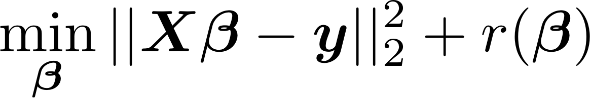
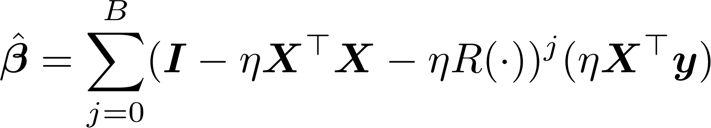
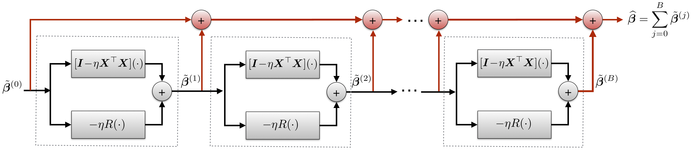
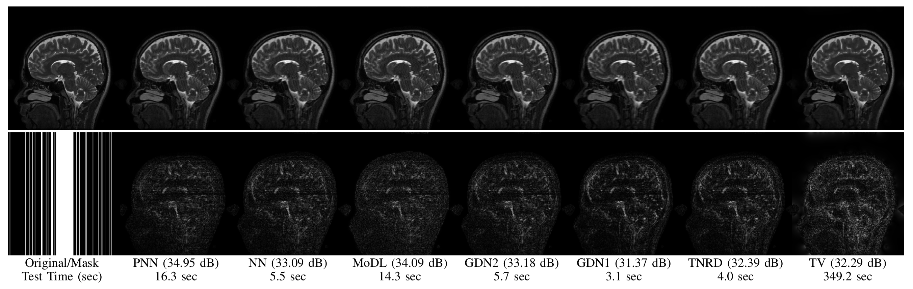
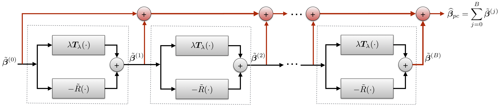

### Important Links:

**Arxiv**: https://arxiv.org/abs/1901.03707  

**Github**: https://github.com/dgilton/neumann_networks_code

### Neumann Networks
The Neumann Network is a method of solving ill-posed linear inverse
problems by learning a nonlinear regularizer, in the form of a deep
neural network. Specifically, the Neumann Network is designed to minimize
the following expression:

  

The Neumann series estimator that solves this problem (for quadratic or linear r()) is:  

  

A visualization of the resulting computational graph is here:  

  

By replacing R() with a deep neural network, we can leverage training data to train the entire network 
end-to-end, similar to existing *unrolled iterative* methods. The resulting Neumann network is not 
motivated by an existing optimization algorithm, permitting novel analysis and empirical benefits.

### Results

We have run experiments for reconstruction tasks on subsets of the Cifar10, CelebA, and STL10 datasets. In 
addition, we demonstrate the potential of the Neumann network for undersampled MRI reconstruction 
by testing on the dataset gathered by Aggarwal et. al (2018) [https://arxiv.org/abs/1712.02862].  

## MRI Reconstruction

### Preconditioning
It is straightforward to incorporate arbitrary preconditioning operators
into the Neumann Network architecture. The below graphic demonstrates
the altered architecture, where T() is the preconditioner. On certain 
types of ill-conditioned forward operators, this preconditioning step can 
considerably improve performance. 

  

The main differences between the preconditioned version and vanilla Neumann Network is in the 
data-consistency term, which has been replaced by a preconditioning operator, and the initialization,
which is replaced by a preconditioned initial estimate.

## Dependencies
This code has been tested on the following:

Tensorflow: 1.13.1

Python: 3.7.3 (But most modern 3.6 should be fine too)

Cuda: 9.0

If you experience issues, please contact the corresponding author via email or submit an issue.
Be especially careful that your Tensorflow version is the same as listed.
I highly recommend installing Tensorflow via conda in a virtualenv.

---

