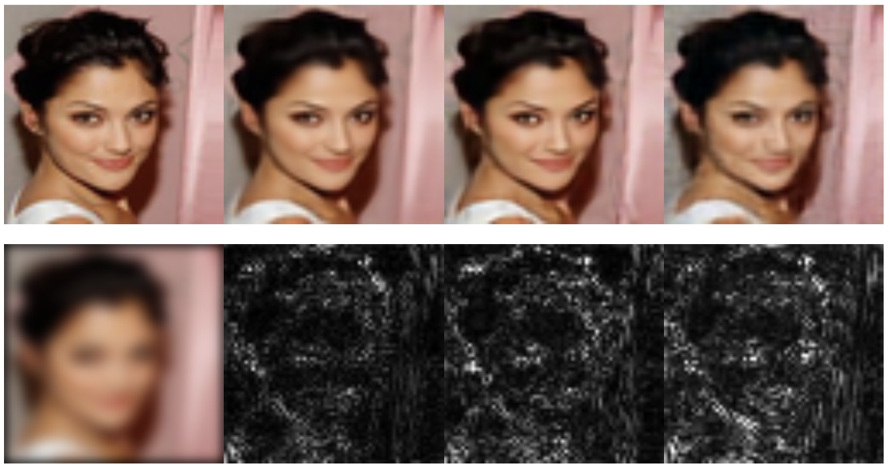
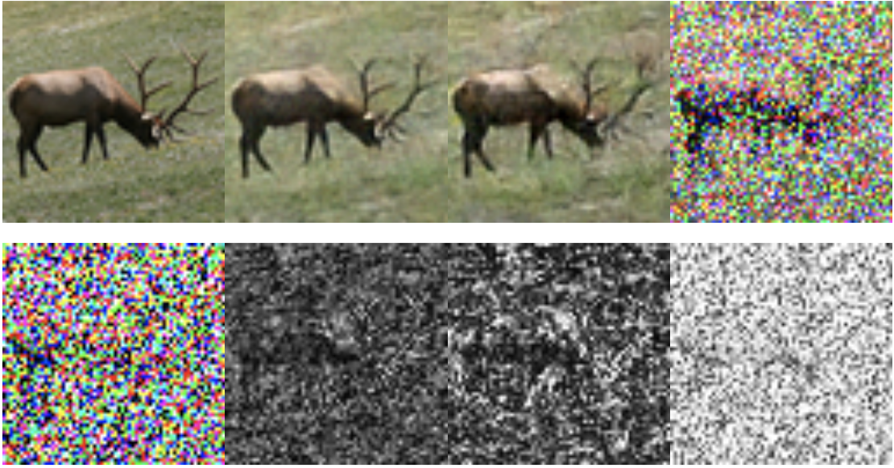

## Important Links:

**Arxiv**: [https://arxiv.org/abs/1901.03707](https://arxiv.org/abs/1901.03707)  

**Github**: [https://github.com/dgilton/neumann_networks_code](https://github.com/dgilton/neumann_networks_code)

## Neumann Networks
The Neumann Network is a method of solving ill-posed linear inverse
problems by learning a nonlinear regularizer, in the form of a deep
neural network. Examples of some such ill-posed linear inverse problems are 
deblurring, inpainting, compressed sensing, undersampled MRI reconstruction, 
deconvolution, superresolution, and more.

Typically these problems are solved by solving the following problem, 
where the solution must both be able to reproduce the original measurements 
(data-consistency) and have some desirable structure (regularization).

The Neumann series estimator that solves this problem (for quadratic regularizer r() ) is:  

A visualization of the resulting computational graph is here:  

  

By replacing R() with a deep neural network, we can leverage training data to train the entire network 
end-to-end, similar to existing *unrolled iterative* methods. The resulting Neumann network is not 
motivated by an existing optimization algorithm, permitting novel analysis and empirical benefits.  

Note that the Neumann series identity used to create the above estimator is not valid in general for 
nonlinear regularizers. However, we demonstrate for data drawn from a union of subspaces and piecewise linear 
regularizer (satisfied by a neural network with ReLU activations) there is an optimal reconstruction 
that has identical form to the Neumann series above.  

The red lines on the above diagram denote long-ranging residual connections, which arise naturally through the 
structure of our estimator. We hypothesize these residual connections result in a more favorable
optimization landscape than more traditional iterative methods. These improvements are especially noticeable 
in the case of small datasets.

### Results

We have run experiments for reconstruction tasks on subsets of the Cifar10, CelebA, and STL10 datasets. In 
addition, we demonstrate the potential of the Neumann network for undersampled MRI reconstruction 
by testing on the dataset gathered by Aggarwal et. al (2018); access their arxiv paper 
[here](https://arxiv.org/abs/1712.02862).  

#### MRI Reconstruction

  

Top row: Original image and reconstructions given by several methods.
Bottom row: Image mask and 

#### CelebA Deblurring

  

From left to right, top row: Original image, Neumann Network reconstruction, 
Gradient Descent Network reconstruction, and single residual network reconstruction.  
Bottom row: Input to the networks, followed by residual images multiplied by 6x for improved visualization.

#### STL10 Compressed Sensing

  

From left to right, top row: Original image, Neumann Network reconstruction,
Gradient Descent Network reconstruction, and single residual network reconstruction.
Bottom row: Input to the networks, followed by residual images multiplied by 6x for improved visualization.

### Preconditioning
It is straightforward to incorporate arbitrary preconditioning operators
into the Neumann Network architecture. The below graphic demonstrates
the altered architecture, where T() is the preconditioner. On certain 
types of ill-conditioned forward operators, this preconditioning step can 
considerably improve performance. 

  

The main differences between the preconditioned version and vanilla Neumann Network is in the 
data-consistency term of each block, which has been replaced by a preconditioning operator, 
and the initialization, which has been replaced by a preconditioned initial estimate.

### Dependencies
This code has been tested on the following:

Tensorflow: 1.13.1  
Python: 3.7.3 (But most modern 3.6 should be fine too)  
Cuda: 9.0  

If you experience issues, please contact the corresponding author via email or submit an issue.
Be especially careful that your Tensorflow version is the same as listed.
I highly recommend installing Tensorflow via conda in a virtualenv.

## Using the code
Documentation for the code and instructions for training and testing are on the 
[Github repo](https://github.com/dgilton/neumann_networks_code).  

If you have questions, requests, ideas, or are interested in a resource that is not provided 
here or on the Github (like a pretrained checkpoint for a problem or method) please contact
Davis Gilton via email. His email is his last name at wisc.edu .

To Do: Downloadable checkpoints. Repository for comparison methods in Tensorflow.

---

